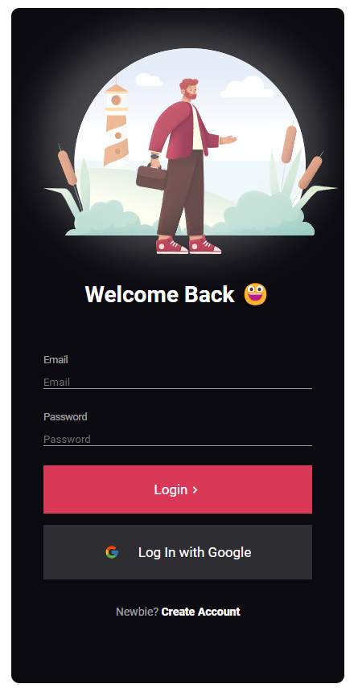

<h1 align="center">Dark Login Screen</h1>

 Um login screen com tema dark 
 

## Indice

- <a href="#funcionalidades-do-projeto">funcionalidades do projeto</a>
- <a href="#como-rodar">Como rodar este projeto</a>
- <a href="#tecnologias-ultilizadas">Tecnologias utilizadas</a>
- <a href="#pessoas-autoras">Pessoas autoras</a>
- <a href="#proximos-passos">Próximos passos</a>

<h2 id="funcionalidades-do-projeto">Funcionalidades</h2>

- [x] tema dark e white, e suas transições
- [x] mostrar e ocultar images
- [x] GET de api de fotos

<h2 id="como-rodar">Como rodar o projeto</h2>
<a href="https://master--ubiquitous-tapioca-4da5cb.netlify.app/">Ver site clicando aqui</a>

<h2 id="tecnologias-ultilizadas">Tecnologias utilizadas</h2> 

1. [HTML]([https://react.dev/](https://developer.mozilla.org/pt-BR/docs/Web/HTML))
1. [CSS]([https://vitejs.dev/](https://developer.mozilla.org/pt-BR/docs/Web/CSS))

<h2 id="pessoas-autoras">Pessoas autoras</h2> 

welder barroso

<h2 id="proximos-passos">Próximos passos</h2> 

- [ ] deixar login funcional
